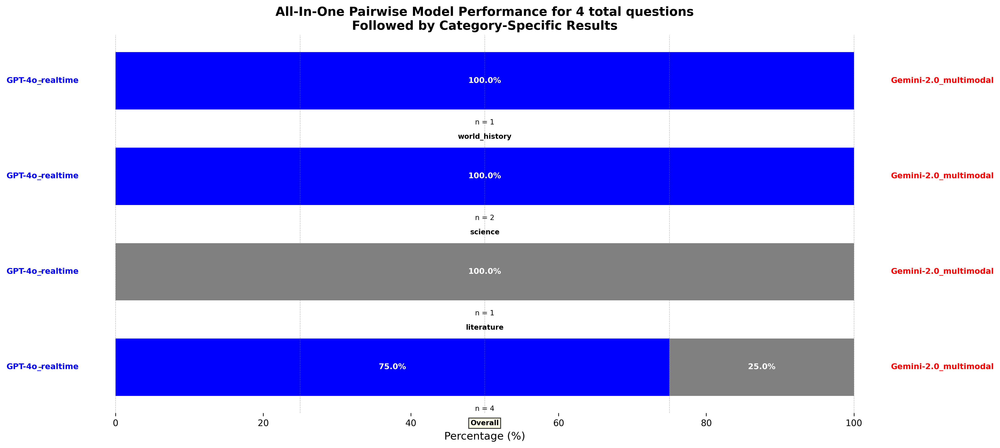

# Audio-Based Jeopardy Competition

## Overview
This project implements an audio-based Jeopardy competition where AI models transcribe and evaluate spoken answers. The system supports OpenAI's GPT-4o and Google's Gemini multimodal models to process audio inputs, transcribe responses, and determine correctness based on Jeopardy rules.

## File Structure

### `models.py`
Defines the core model handlers for processing audio-based Jeopardy responses.
- Implements `BaseModelHandler` as the parent class.
- `OpenAIHandler`: Uses OpenAI's GPT-4o for real-time speech recognition.
- `GeminiLiveHandler`: Uses Google's Gemini-2.0 multimodal model for processing.
- Functions for encoding, processing, and validating answers using AI models.

### `play_game.py`
Runs a full Jeopardy-style game session using AI models.
- Loads and reads a dataset of Jeopardy questions from a JSONL file.
- Initializes AI model handlers.
- Iterates over audio-based questions and processes them using the selected model.
- Saves results in a structured JSON format for later analysis.

### `process_results.py`
Merges multiple result files into a single combined JSON file for analysis.
- Reads all JSON files from the `results/` directory.
- Ensures each question has results from all models, filling missing data where necessary.
- Produces a final `combined_results.json` file for downstream analysis.

### `visualize_pairwise.py`
Generates performance comparisons between models.
- Computes accuracy and processing time statistics.
- Evaluates model performance pairwise using predefined criteria.
- Produces a detailed bar chart comparing models across different question categories.

## Dependencies
Ensure you have the following Python packages installed:
```sh
pip install numpy openai google-generativeai pydub gtts librosa tqdm pandas whisper matplotlib
```
Additionally, make sure you have a `.env` file with API keys:
```
OPENAI_API_KEY=your_openai_key
GOOGLE_API_KEY=your_google_key
```

## Running the Program
To execute the game:
```sh
python play_game.py
```
This will process Jeopardy questions, run audio models, and store the results in `results/`.

To merge and analyze results:
```sh
python process_results.py
python visualize_pairwise.py
```

## Output Format
Results are stored in JSON format as follows:
```json
{
    "0": {
        "question": "'James Jones' 1962 novel \"The Thin Red Line\" was a sequel to this 1951 work'",
        "correct_answer": "\"From Here to Eternity\"",
        "category": "literature",
        "results": {
            "GPT-4o_realtime": {
                "transcript": "What is \"From Here to Eternity\"?",
                "audio_path": "gpt_assistant_output.wav",
                "processing_time": "0.060811",
                "success": true,
                "correct": true
            },
            "Gemini-2.0_multimodal": {
                "transcript": "What is \"From Here to Eternity\"?",
                "audio_path": "gpt_assistant_output.wav",
                "processing_time": "0.060811",
                "success": true,
                "correct": true
            }
        }
    }
}
```

## Visualization
The script `visualize_pairwise.py` generates a comparative bar chart, saved as `pairwise_all_in_one.png`:



## Accuracy and processing time metrics
```
===========================
Accuracy (Overall):
===========================
GPT-4o_realtime           => 4/4 = 100.0%
Gemini-2.0_multimodal     => 1/4 = 25.0%

===========================
Accuracy (By Category):
===========================

----- GPT-4o_realtime -----
  literature                => 1/1 = 100.0%
  science                   => 2/2 = 100.0%
  world_history             => 1/1 = 100.0%

----- Gemini-2.0_multimodal -----
  literature                => 1/1 = 100.0%
  science                   => 0/2 = 0.0%
  world_history             => 0/1 = 0.0%

===========================
Mean Processing Time (Overall) [seconds]:
===========================
GPT-4o_realtime           => 0.0317s (across 4 answers)
Gemini-2.0_multimodal     => 0.0608s (across 4 answers)

===========================
Mean Processing Time (By Category) [seconds]:
===========================

----- GPT-4o_realtime -----
  literature                => 0.0608s (across 1 answers)
  science                   => 0.0024s (across 2 answers)
  world_history             => 0.0610s (across 1 answers)

----- Gemini-2.0_multimodal -----
  literature                => 0.0608s (across 1 answers)
  science                   => 0.0608s (across 2 answers)
  world_history             => 0.0608s (across 1 answers)
```


